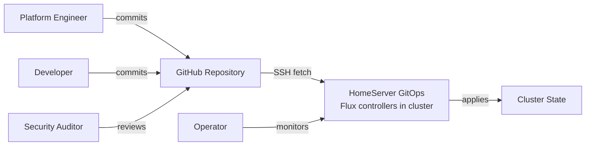
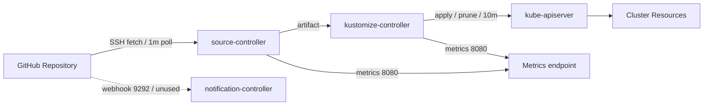

# Context and Scope

*Last verified against repository state: 2026-09-15.*

## Business Context

### Context Diagram

### External Actors and Interfaces

| Actor | Role | Interaction |
|-------|------|-------------|
| GitHub Repository | Source of truth | Hosts the Git repository; polled by source-controller over SSH (CON-006). |
| Platform Engineer (Owner) | Maintains infrastructure | Commits manifests to `main`; runs `flux bootstrap` on new clusters. |
| Developer (Workload Author) | Deploys applications | Commits workload manifests via Git (future — no workloads today, GAP-003). |
| Operator (On-call) | Monitors health | Observes reconciliation status; observability is currently limited (GAP-004). |
| Security Auditor | Reviews security posture | Reviews Git history, manifests, RBAC and policies. |

The system's business purpose is to keep the HomeServer cluster state identical to the Git repository. Humans interact with the system **only through Git**; there is no direct human-to-cluster workflow for managed resources (NFR-004).

## Technical Context

### Technical Context Diagram

### Technical Interfaces

| Interface | Protocol | Direction | Frequency | Purpose |
|-----------|----------|-----------|-----------|---------|
| Git fetch | SSH | inbound to GitHub | 1m | source-controller polls the repository for new commits (REQ-002). |
| Artifact consumption | HTTP | internal (source-controller → kustomize-controller) | on demand | kustomize-controller fetches the source artifact for building. |
| Reconciliation apply | kube-apiserver | internal (controllers → API) | 10m | apply and prune cluster resources (REQ-003). |
| Metrics | HTTP 8080 | inbound | scrape | Prometheus metrics endpoints; no scraper configured yet (GAP-004). |
| Webhook | HTTP 9292 | inbound to notification-controller from GitHub | unused | push-based change notifications; no Receiver configured (GAP-001, GAP-012). |

### Mapping Input/Output to Channels

| Input | Channel | Output | Downstream |
|-------|---------|--------|------------|
| Git commit on `main` | SSH fetch by source-controller (1m poll) | New artifact revision | kustomize-controller applies changes (10m reconcile). |
| — | — | — | No push channel exists: a webhook Receiver is not configured (CON-008, GAP-001). |