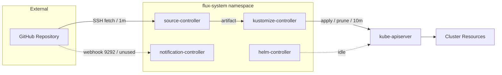

# Building Block View

*Last verified against repository state: 2026-09-15.*

## Whitebox Overall System

**Motivation.** The system is a minimal Flux v2.9.5 bootstrap layer. All building blocks live in the `flux-system` namespace of each cluster; the only external dependency is the GitHub repository. The system's purpose is to keep cluster resources converged to the Git state.

**Contained Building Blocks.** The system contains four Flux controllers (source-controller, kustomize-controller, helm-controller, notification-controller), the security primitives of the `flux-system` namespace (labels, NetworkPolicies, ResourceQuota, RBAC), and the two Flux resources that drive reconciliation (GitRepository `flux-system`, Kustomization `flux-system`).

**Important Interfaces.** The controllers expose metrics on port 8080 and healthz; notification-controller additionally listens on port 9292 for webhooks (currently unused). source-controller provides an HTTP artifact service on port 80. All controllers talk to the kube-apiserver via their ServiceAccounts.

### Contained Building Blocks

| Building block | Kind | Count per cluster |
|----------------|------|-------------------|
| source-controller | Deployment + Service | 1 |
| kustomize-controller | Deployment | 1 |
| helm-controller | Deployment | 1 |
| notification-controller | Deployment + Service | 1 |
| GitRepository `flux-system` | Flux source resource | 1 |
| Kustomization `flux-system` | Flux apply resource | 1 |
| NetworkPolicies | `allow-egress`, `allow-scraping`, `allow-webhooks` | 3 |
| ResourceQuota | `critical-pods-flux-system` | 1 |
| RBAC | ClusterRoles + ClusterRoleBindings | 5 |

### Important Interfaces

| Interface | From | To | Protocol / Port | Purpose |
|-----------|------|----|-----------------|---------|
| Git fetch | source-controller | GitHub | SSH / 22 | Poll repository (1m). |
| Artifact HTTP | source-controller Service | kustomize-controller | HTTP / 80 | Fetch source artifact. |
| Metrics | any | controllers | HTTP / 8080 | Prometheus metrics (no scraper yet — GAP-004). |
| Webhook | any | notification-controller | HTTP / 9292 | Push notifications (unused — GAP-012). |
| kube-apiserver | controllers | API server | HTTPS / 6443 | Apply, prune, status updates (RBAC-scoped). |

## Black Boxes

### source-controller

- **Purpose/Responsibility:** Fetches the Git repository over SSH and produces a source artifact; records the artifact revision.
- **Interface(s):** SSH Git fetch (1m poll); HTTP artifact service (Service `source-controller`, port 80); metrics on 8080.
- **Quality/Performance characteristics:** Poll interval 1m0s; single replica; `Recreate` update strategy.
- **Directory/File location:** `clusters/<cluster-name>/flux-system/gotk-components.yaml`.
- **Fulfilled requirements:** REQ-001, REQ-002, REQ-010.
- **Open issues:** No webhook push channel (GAP-001); no metrics scraping configured (GAP-004).

### kustomize-controller

- **Purpose/Responsibility:** Reconciles the `flux-system` Kustomization: fetches the artifact, runs `kustomize build`, diffs against live state, applies changes and prunes resources removed from Git.
- **Interface(s):** Artifact HTTP fetch; kube-apiserver apply/prune; metrics on 8080.
- **Quality/Performance characteristics:** Reconcile interval 10m0s; `prune: true`; single replica.
- **Directory/File location:** `clusters/<cluster-name>/flux-system/gotk-components.yaml` (controller) and `gotk-sync.yaml` (Kustomization).
- **Fulfilled requirements:** REQ-001, REQ-003, REQ-009; NFR-002.
- **Open issues:** None specific; drift correction latency is bounded by the 10m interval.

### helm-controller

- **Purpose/Responsibility:** Reconciles HelmRelease resources.
- **Interface(s):** kube-apiserver; metrics on 8080.
- **Quality/Performance characteristics:** Installed as part of the standard Flux component set; **idle** — no HelmReleases exist (CON-007).
- **Directory/File location:** `clusters/<cluster-name>/flux-system/gotk-components.yaml`.
- **Fulfilled requirements:** REQ-001.
- **Open issues:** Unused component (see ADR-010).

### notification-controller

- **Purpose/Responsibility:** Handles webhook Receivers and dispatches notifications/alerting.
- **Interface(s):** Webhook listener on port 9292 (NetworkPolicy `allow-webhooks`); metrics on 8080.
- **Quality/Performance characteristics:** Installed; **idle** — no Receivers or alerting configured (GAP-012).
- **Directory/File location:** `clusters/<cluster-name>/flux-system/gotk-components.yaml`.
- **Fulfilled requirements:** REQ-001, REQ-006 (allow-webhooks policy).
- **Open issues:** Unused component; no alerting (GAP-004, GAP-012).

### flux-system Namespace & Security Primitives

- **Purpose/Responsibility:** Hosts all Flux components and enforces the namespace security baseline.
- **Interface(s):** Namespace labels (pod security `restricted` warn), NetworkPolicies (`allow-egress`, `allow-scraping` 8080, `allow-webhooks` 9292), ResourceQuota `critical-pods-flux-system` (1000 pods, critical priority classes), RBAC (`cluster-reconciler-flux-system`, `crd-controller-flux-system`, `flux-edit-flux-system`, `flux-view-flux-system`).
- **Quality/Performance characteristics:** Byte-identical across clusters.
- **Directory/File location:** `clusters/<cluster-name>/flux-system/gotk-components.yaml`.
- **Fulfilled requirements:** REQ-005, REQ-006, REQ-007, REQ-008.
- **Open issues:** Pod security is warn-only (not enforced); no policy engine (GAP-014).

### GitRepository (flux-system)

- **Purpose/Responsibility:** Declares the Git source: `main` branch, SSH URL, 1m poll, secretRef `flux-system`.
- **Interface(s):** SSH fetch to GitHub.
- **Quality/Performance characteristics:** `interval: 1m0s`.
- **Directory/File location:** `clusters/<cluster-name>/flux-system/gotk-sync.yaml`.
- **Fulfilled requirements:** REQ-002.
- **Open issues:** Polling-only latency (GAP-001).

### Kustomization (flux-system)

- **Purpose/Responsibility:** Declares the apply policy: path `./clusters/<cluster-name>`, 10m reconcile, `prune: true`, sourceRef GitRepository `flux-system`.
- **Interface(s):** kube-apiserver apply/prune.
- **Quality/Performance characteristics:** `interval: 10m0s`.
- **Directory/File location:** `clusters/<cluster-name>/flux-system/gotk-sync.yaml`.
- **Fulfilled requirements:** REQ-003.
- **Open issues:** None specific.

## Level 2 — Reconciliation Pipeline

### White Box: Source Pipeline (source-controller)

The source pipeline runs inside source-controller for each GitRepository:

1. **Clone** — the controller clones the repository over SSH (using the deploy key from Secret `flux-system`).
2. **Archive** — the working tree is archived into a compressed artifact.
3. **Publish** — the artifact is stored and exposed over HTTP; the GitRepository status records the new revision (`main@sha1:<commit>`).

The pipeline runs every 1m (interval) or on demand. Failure to reach GitHub results in `Ready=False` on the GitRepository; the last-known-good artifact is retained.

### White Box: Apply Pipeline (kustomize-controller)

The apply pipeline runs inside kustomize-controller for each Kustomization:

1. **Fetch artifact** — the controller downloads the artifact from source-controller over HTTP.
2. **Build** — `kustomize build` renders the manifests for `./clusters/<cluster-name>`.
3. **Diff** — the rendered manifests are compared with the live cluster state.
4. **Apply** — changes are applied to the kube-apiserver.
5. **Prune** — resources present in the cluster but absent from Git are removed (`prune: true`).
6. **Status** — the Kustomization status conditions are updated (`Ready=True/False`).

The pipeline runs every 10m (interval). Drift introduced between reconciles is corrected on the next run (NFR-002).