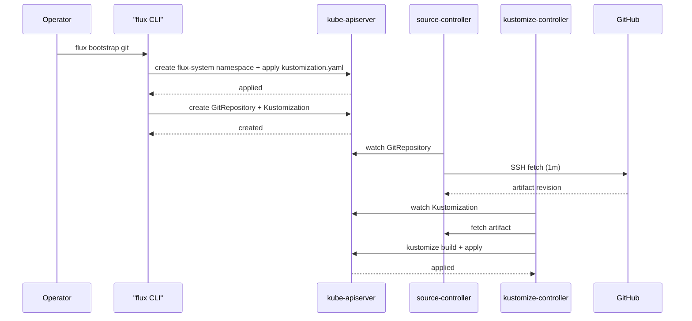
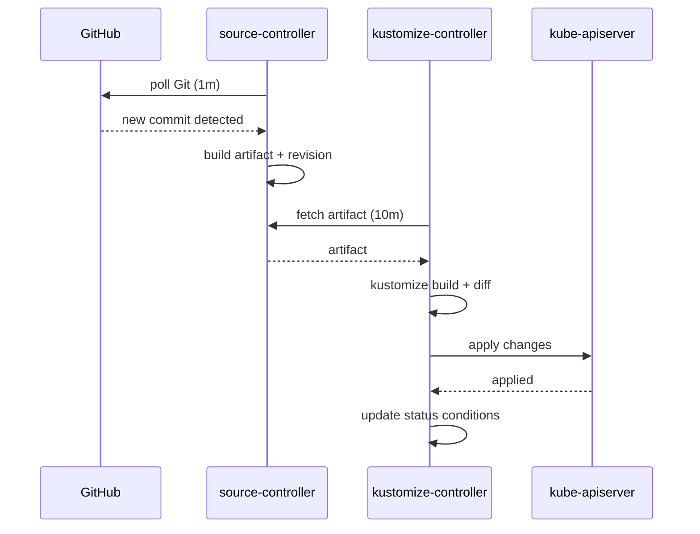
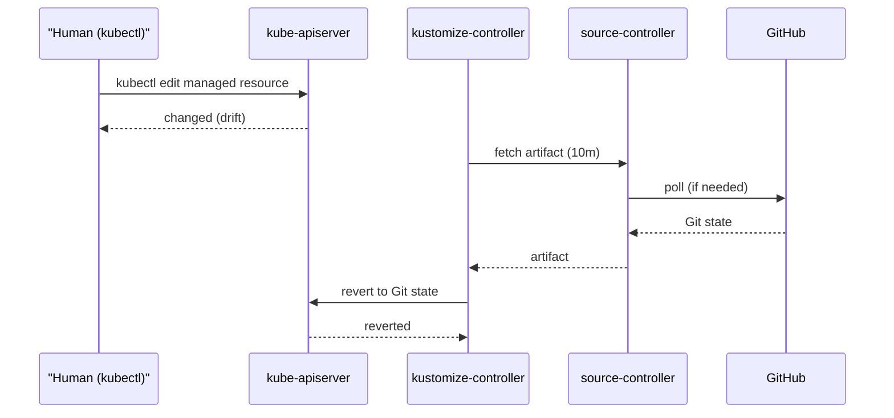

# Runtime View

*Last verified against repository state: 2026-09-15.*

This section describes the runtime behavior of the system through three scenarios. Component names and interfaces follow the [Building Block View](05_building_block_view.md).

## Scenario 1: Initial Bootstrap

The only human-triggered operation in the system (NFR-004): an operator bootstraps a fresh cluster with `flux bootstrap git`.

**Notable aspects.** The bootstrap is the only operation performed directly against the cluster; everything after it is driven by Git. The same procedure on any cluster produces an identical Flux deployment from the same commit (NFR-003). The bootstrap procedure itself is not yet documented in the repository (GAP-011).

## Scenario 2: Steady-State Reconciliation

The normal operating mode: Flux continuously polls Git and reconciles the cluster.

**Notable aspects.** The cadence is fixed by the resource intervals: 1m for the GitRepository and 10m for the Kustomization. Because there is no webhook Receiver, the maximum latency for a change to reach the cluster is ~10 minutes (GAP-001).

## Scenario 3: Drift Detection and Correction

Flux detects and corrects drift between the Git state and the live cluster state (NFR-002).

**Notable aspects.** Two drift cases are handled:

1. **Manual modification** — a Flux-managed resource is edited out-of-band; at the next reconcile (≤10m) kustomize-controller reverts it to the Git state.
2. **Deletion from Git** — a resource is removed from the repository; at the next reconcile it is **pruned** from the cluster (`prune: true`).

**Failure handling.** If GitHub is unreachable, source-controller reports `Ready=False` and kustomize-controller keeps applying the last-known-good artifact. There is no alerting configured, so failures are not proactively surfaced (GAP-004).